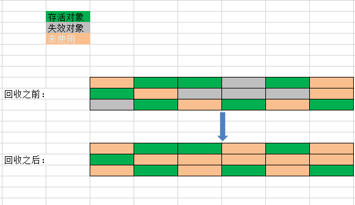
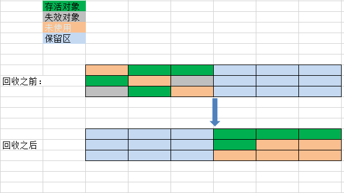
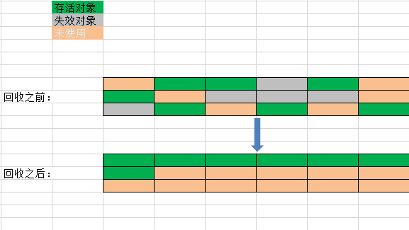

* content
{:toc}

1.标记——清除算法（Mark-Sweep）
----------------

​	标记——清除算法是第一种使用和比较完善的垃圾回收算法，算法分为两个过程：1、标记正所有需要回收的对象2、标记完成后清除被标记的对象。其标记的过程就是判断对象有效性，执行可达性分析的过程。其执行流程图大体如何下所示： /images/blog/blobs/git-workflow/02-github-flow.png)

​	同样，我们也借助现实的场景进行描述。图书管里有好多人在看书，图书管理员想要收集起没有被看的书的时候，他决定让所有正在看书的人站起来，然后询问每个人：那一本书是不看的。询问完所有的人之后，同学们做下继续看书。这时候，图书管理员开始寻找所有做过标记的书，把它们收集起来。

缺点： 

1. 每次进行垃圾回收时，会暂停当前用户程序的运行（类似让所有的同学站起来） 
2. 垃圾回收器需要间隔性的检查，并且标记和清除的过程相对较慢。 
3. 在标记清除之后可能会产生大量内存碎片，导致一旦需要为大对象分配空间时，由于找不到足够大的内存空间，而不得以引发另外一次GC过程。

2.标记——复制算法（Mark——Copy）
----------------

​	标记——复制存储算法通过采用双区域交替使用这种方式解决了标记——清除算法中效率低下的问题。它将可可用内存划分为两个等量的区域（使用区和空闲区），每次只使用一块。当正在使用的区域需要进行垃圾回收时，存活的对象将被复制到另外一块区域。原先被使用的区域被重置，转为空闲区。其执行流程大体如下所示：

​	图书管理员为了更好的发现不看的书，将图书室一分为二(A区和B区)，同一时刻只有一块区域允许看书。开始时只允许在A区看书。当管理员想要回收A区不被看的书的时候，大喊一嗓子“正在看书的同学拿着你书到B区”。等所有人都到了B区后，图书管理员只要把A区的书收集起来，就完成了任务。下一次收集的时候，则是要求同学带着自己看的书从B区转移到A区。如此循环往复即可。

缺点： 
1、原有可用空间被缩小为1/2，空间利用率降低了。 
2、过程中也会暂停当前应用的运行。

3.标记——整理算法（Mark——Compat）
----------------

​	标记-复制算法在对象存活率较高的情况下就要进行较多的复制操作，更重要的是该算法浪费一般的内存空间，为了解决该问题，出现了标记——整理算法：其标记的过程和“标记-清除”算法一样，而整理的过程则是让所有存活的对象都想另外一端移动，然后直接清理掉端边界以外的内存。其执行流程大体如下所示： 

缺点： 
1、暂停当前应用的运行，非实时性的回收。

4.分代收集算法
----------------

​	分代收集算法理论来源于统计学。IBM公司的专门研究发现，对象的生存周期总体可分为三种：新生代、老年代和永久代。因此可以根据各个年代的特点采用适当的垃圾回收算法。比如新生代的对象在每次垃圾时都会有大量的对象死去，只有很少一部分存活，那就可以选择标记-复制算法。另外I，在新生代中每次死亡对象约占98%，那么在标记-复制算法中就不需要按照1：1的比例来划分内存区域，而是将新生代细分为了一块较大的Eden和两块较小的Survivor区域，HotSpot中默认这两块区域的大小比例为8：2。每次新生代可用区域为Eden加上其中一块Survivor区域，共90%的内存空间，这样就只有10%的内存空间处在被闲置状态。在进行垃圾回收时，存活的对象被转移到原本处在“空闲的”Eden区域。如果某次垃圾回收后，存活对象所占空间远大于这10%的内存空间时，也就是Survivor空间不够用时，需要额外的空间来担保，通常是将这些对象转移到老年代。对于老年代来说，大部分对象都处在存活状态。同时，如果一个大对象要在该区域进行分配，而内存空间又不足，那么在没有外部内存空间担保的情况下，就必须选用标记-清除或者标记-整理算法来进行垃圾回收了。

总而言之，分代收集只是根据对象生存周期的不同来选择不同的算法，其本身并没有任何新思想。

5.增量收集算法
----------------

​	以上所述的算法，都存在一个缺点：在进行垃圾回首时需要暂停当前应用的执行，也就是这时候的垃圾回收线程不能和应用线程同时运行。如果我们想做到“在不打断同学们看书的情况下，图书管理员就可以收集没有被看的书”，这也是增量收集算法的目标，即在不中断应用线程的状态下垃圾回收线程也能进行垃圾回收。但是这里需要面对的问题是：垃圾回收线程在标记阶段标记好了，还没来的及清除时，当前应用线程进行内存操作，以至于清除阶段无法正确开展，类似的情况是：图书管理员刚标记了《JAVA核心技术》这本书已经没有人看了，等标记完后，却发现这本书已经有人在看了。

​	增量收集算法的基础仍是传统的标记－清除和复制算法。增量收集算法通过对进程间冲突的妥善处理，允许垃圾收集进程以分阶段的方式完成标记、清理或复制工作。详细分析各种增量收集算法的内部机理是一件相当繁琐的事情，在这里，读者们需要了解的仅仅是： H. G. Baker 等人的努力已经将实时垃圾收集的梦想变成了现实，我们再也不用为垃圾收集打断程序的运行而烦恼了。