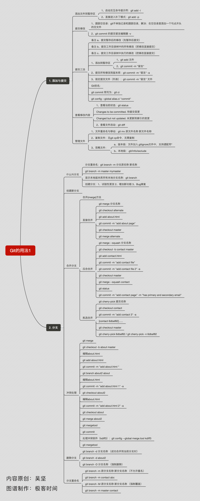

* content
{:toc}

1.Git常用指令：
--------------
1.git  全局配置  --loacl  --system --global
	
	 $ git config --global user.name author #将用户名设为author
	 $ git config --global user.email author@corpmail.com #将用户邮箱设为author@corpmail.com

2.新增合并提交：

   	$ git commit -m 'initial commit'
	$ git add forgotten_file
	$ git commit --amend
	最终你只会有一个提交 - 第二次提交将代替第一次提交的结果。

3.Git 中创建一个附注标签

	$ git tag -a v1.4 -m 'my version 1.4'
	$ git tag v0.1 v1.3 v1.4 -m 选项指定了一条将会存储在标签中的信息。

4、分支创建

	$ git branch testing

  分支切换

	$ git checkout testing

  分支的合并

	$ git checkout master
	//*Switched to branch 'master'
	$ git merge iss53
	/*Merge made by the 'recursive' strategy.
	index.html |    1 +
	1 file changed, 1 insertion(+)*/

5.拉取分支

  	当 git fetch 命令从服务器上抓取本地没有的数据时，它并不会修改工作目录中的内容。 它只会获取数据然后让你自己合并。
  	然而，有一个命令叫作 git pull 在大多数情况下它的含义是一个 git fetch 紧接着一个 git merge 命令。

6.重置Git全局配置密码和用户名：

	输入一行命令：
		
	git config --system --unset credential.helper

	之后再进行git操作时，弹出用户名密码窗口，输入即可

  
附一张git常用指令指南：

